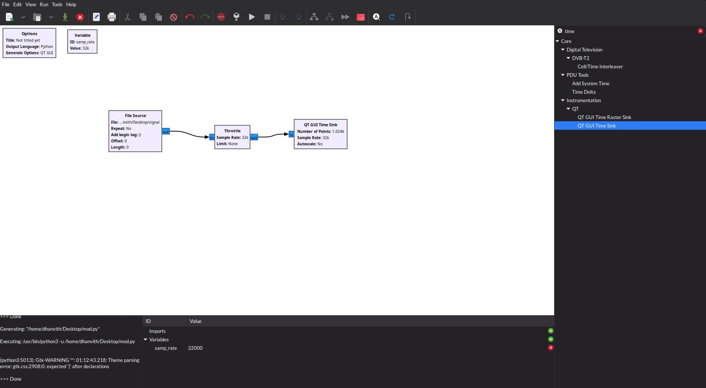
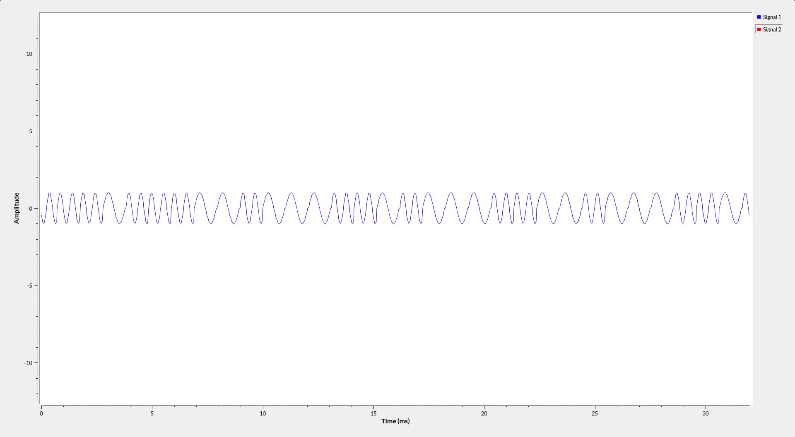
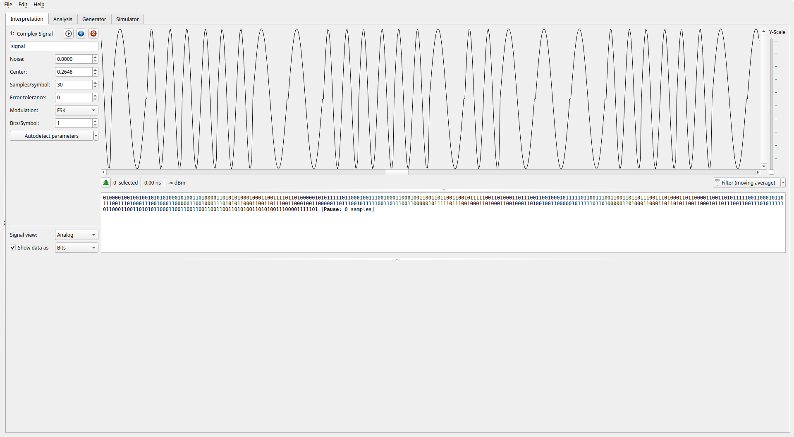

# %ulation

Points: 366
Solves: 83

> Shifting keys or something idk.

`Author: d4y0n3`

---

Pretty straightforward challenge here. The description hinted that the signal file could possibly be modulated by some shift-keying technique. First I checked the frequency spectrum using `inspectrum` but did not get any reliable lead from it. So I pulled up trusty old `gnuradio-companion` and built a basic flow graph to have a look at the waveform of the signal file.



The waveform was a classic binary [FSK](https://en.wikipedia.org/wiki/Frequency-shift_keying) modulated signal. The part in the waveform where the frequency of the signal suddenly jumps up encodes 1 and the other encodes 0. Could be the other way around too, of course.



Now I could manually decode the binary information from this point, but I set on a hunt for another tool that could do this for me and I came across this amazing tool called [Universal Radio Hacker](https://github.com/jopohl/urh) which can be used to basically decode a radio signal by brute-force. I opened the signal file in it and pretty much instantaneously got the decoded binary information from the signal.



Now just convert the binary sequence to ASCII and you get the flag. ez

---

```sh
BITSCTF{A_br13f_4nd_g3ntl3_1ntr0duc710n_70_r4di0_h4ck1ng_c5c33558}
```
