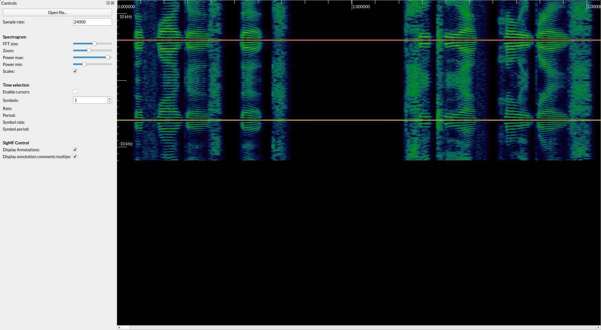
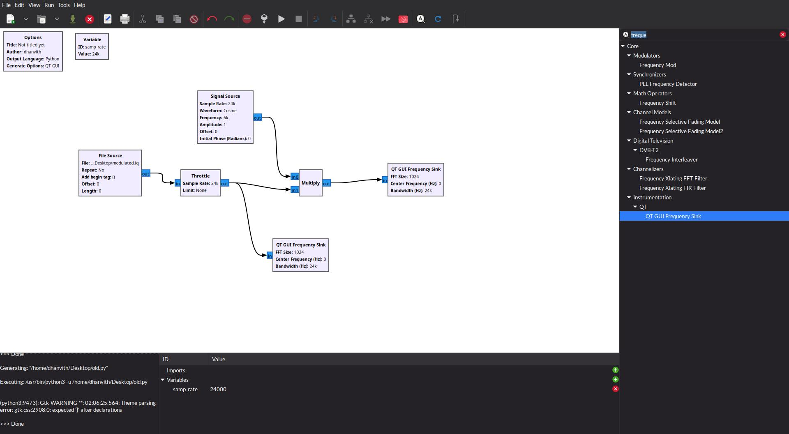
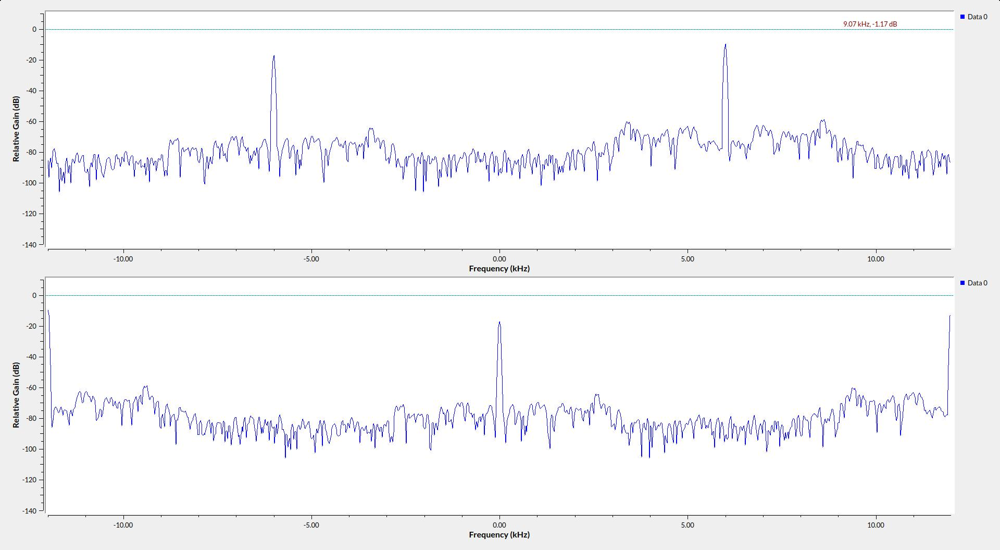
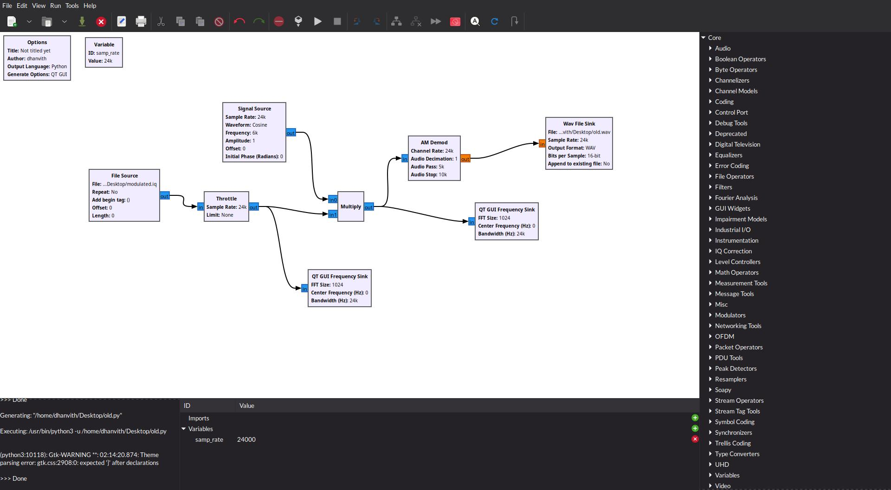

# Old Skool

Points: 431
Solves: 60

> I remember my father talking about those old age radios and how they work. Pretty cool if you ask me. Also he told me about a radio channel which had a frequency between 1500-1599khz from PHILIPPINES. Note: Sampling Rate for the file is 24kHz

`Author: d4y0n3`

---

Okay this was a pretty fun challenge. First things first, open up the given iq file in `inspectrum` and there is a clearly visible carrier frequency of 6 kHz. The low frequency of the carrier meant the signal was most likely [amplitude modulated](https://en.wikipedia.org/wiki/Amplitude_modulation).



So I drew up a flow graph in `gnuradio-companion` to demodulate the signal, hoping that it would turn out to be AM only. We first multiply the input with the carrier frequency to [downconvert](https://www.reddit.com/r/AskEngineers/comments/2q6o7e/dsp_what_does_it_mean_to_downconvert_a_signal/) the signal



Here is a pic showing the input signal (the one on top) and the downconverted signal



Next add an AM Demod block with the `audio_stop` parameter at around 10 kHz and we get a [pitched up audio recording](./old_skool.wav) from the input. This is the final flow graph in GNU Radio gnuradio-companion



Pitch this audio down and slow it down, and you get the flag directly IN YO FACE

[Final audio](./old_skool_pitched_down.mp3)

Spent too much time wondering wth did the Philippines thing have to do with this puzzle. And I still have no idea.

---

```sh
BITSCTF{welcome_to_our_radio_enjoy_our_song_collection}
```
