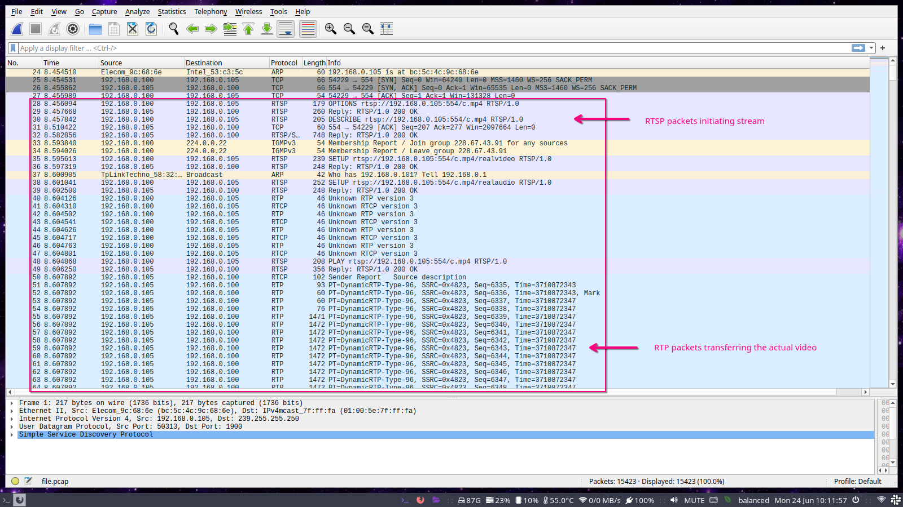
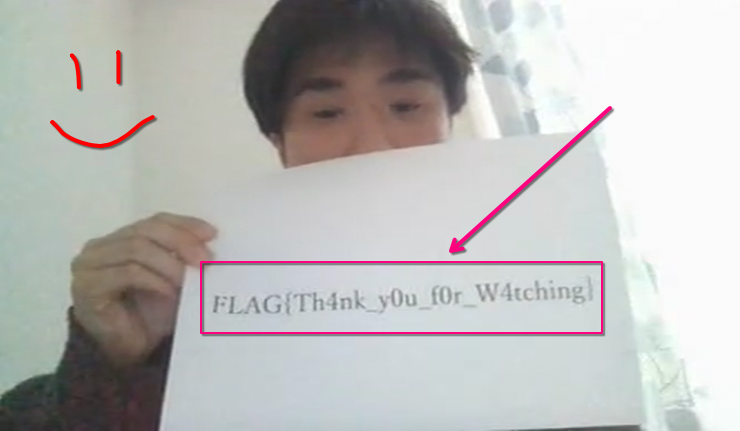

# I_wanna_be_a_streamer

```
rating: easy
points: 169pt
```

description:

> Sorry Mom, I'll work as a streamer.
> Watch my stream once in a while.
> (H.264 is used for video encoding.)

## Approach

In this challenge we were give the `file.pcap` file, where `pcap` is a packet capture file. I was sure that packet capture meant that this had something to do with Wireshark so I immediately installed Wireshark with

```
sudo pacman -S wireshark-qt
```

I opened up the `pcap` file in Wireshark and started going through the packets. I noticed some `TCP` ones in the start but they didn't seem to have any data so I kept going. Eventually I noticed the `RTSP` packets and decided to ddg what they were, and Wikipedia said they were following the `Real-Time Streaming Protocol`

This was interesting because the challenge name was I_wanna_be_a_streamer. I read some more and learnt that the RTSP initiated the stream, and then the `RTP` packets started sharing the video.



The rest of the packet capture was just the stream itself, so I decided that we probably had to somehow download the video from these RTP packets. I searched for ways to do this online.

- [one](https://osqa-ask.wireshark.org/questions/43920/how-to-replay-the-video-from-packets-captured-by-wireshark/) was to follow `Telephony -> RTP -> RTP Streams` but I faced some issues with that as I was still new to Wireshark.
- another resource I found was [this stackoverflow qn](https://stackoverflow.com/questions/16552107/how-to-convert-h264-rtp-stream-from-pcap-to-a-playable-video-file) that told me about the `videosnarf` tool

I tried installing `videosnarf` from source, but it wouldn't work for some reason. At this point I shared my progress with th team, when [Harsh](https://github.com/harshkhandeparkar) pointed out that `videosnarf` is in the AUR too. We installed it with

```
yay -S videosnarf
```

and ran it on the pcap with

```
videosnarf -i file.pcap
```

this created the required H.264 coded video which we converted to .mp4 and played on VLC to reveal the flag.

### Flag



FLAG: `FLAG{Th4nk_y0u_f0r_W4tching}`
