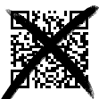
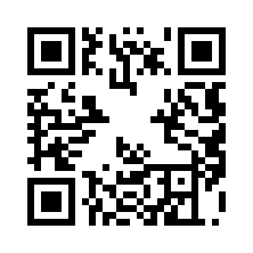

# codebreaker

```
rating: Beginner
points: 140pt
```

description:

> I, the codebreaker, have broken the QR code!

# Approach

First I noticed that it was png, so I did the standard steg things like

```
file *.png
exiftools *.png
strings *.png
binwalk *.png
```

but I didn't get any results.

In the first CTF I ever did, **NahamCon2024**, there was a challenge where he gave a rectangular QR code, and the only way to read it was with the *Denso Wave* QR code reader app. (Denso were the original creators of the QR code I think). I tried with the app too, but no luck.

I began searching for ways to read partial QR Codes and came across a [fantastic article](https://freedium.cfd/https://medium.com/@nteezy/how-to-decode-a-partially-visible-or-damaged-qr-code-a-ctf-writeup-for-stack-the-flags-2020-4ef0eb6a018f)

In the article the author mentioned QRazyBox, so I decided to use that. I recreated the amount of the QR that I could see in QRazyBox, and then scanned it. This gave us the flag.

I highly recommend reading the article, he goes into a lot of depth on QR codes, and from that I realised that the QR code we were given offers the highest possible error tolerance which was why we could scan it even with so many missing data pieces.

## Flag

challenge image:



recreated in QRazyBox:



FLAG: `FLAG{How_scan-dalous}` scanned with Denso Wave app, which took a lot of time
