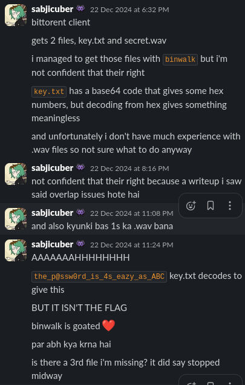

# Torrent Tempest

Points: ???

> I was in the middle of downloading an important file using a peer-to-peer protocol, but something went wrong. I captured all the traffic but I’m a bit lost in this deep sea of data. Can you help me piece the file back together? https://drive.google.com/file/d/1xXuUaLjswpDGNGm0VagjSJOnpLrHcH94/view?usp=sharing

`Author: W01f`

---

we are given a `pcap` file that apparently has files being shared via the bittorent protocol.

I started by looking for similar ctf challenges in the past and found these writeups.
[infohashes](https://github.com/pmateja/picoCTF_2022_writeups/blob/main/Torrent_Analyze.md) and [file recovery from torrent](https://github.com/VulnHub/ctf-writeups/blob/master/2015/0ctf/peers.md).
The file recovery writeup is quite useful, however the given pcap did not have many of the properties that the writeup took
advantage of. Basically the data was not being sent in `bittorrent pieces` but rather in `bittorent continuous data`, or atleast my version couldn't recognise it as such. This led me to believe 
this was some extension of the bittorent protocol so I decided to do some digging. 

First I naively tried running `binwalk` on the pcap in the hopes that it would be able to recreate the files, and to my surprise it did return something.
It managed to give me a `key.txt` which had a `base64->hex->rot13` ciphertext that [dcode.dr/en](https://dcode.fr/en) managed to crack (cyberchef didn't pick up the rot13).
It also gave me a `secret.wav` however this was not the correct file as it was not restored correctly and I wasted a LOT of time looking for something in this. I went through many, many .`wav` steg ctf writeups. 
Finally a ticket confirmed that this was the wrong file and I decided to try again.




I had found this [entry](https://wiki.theory.org/BitTorrentSpecification#Extension_protocol) about the protocol that mentioned the 
extension protocol and pointed me to [this resource](https://www.libtorrent.org/extension_protocol.html). This extension did seem to match the given pcap a little, 
but I still couldn't see anything about `continuous_data` in it. At this point I had given up and moved on to other challenges. 

Finally after the CTF I went through some of the writeups and had discord open to see the discourse.
First hint was the first `continuous_data` packets had the names of the files in them. I saw this, but
what I didn't realise was that the file contained the file signature for a `PKzip` file. This 
gave me something concrete to look into and a basis to start recreating the file. I knew we would use `pyshark` to recreate this, but this was
my first time writing a pyshark script, so I cheated a little more and went to writeup. Credit to
[@sealldev](https://seall.dev/posts/backdoorctf2024) for his very simple solve script.


```py
# Main logic
for index, packet in enumerate(torrent):
    print(f"processing packet no {index}")
    data = packet.bittorrent.continuous_data.replace(":", "")
    data = unhexlify(data)[13:]
    print(data[:20])
    if data not in result:
        result.append(data)
```

I considered using a `set` for faster checking as this script takes like 5 minutes to run, but python sets are not ordered :(

This successfully recreated the `.zip` file and gave me the correct `flag.txt` and `secret.wav` files. 

Now because at this point I had already read the writeups I knew that Deepsound was used to encrypt `flag.txt`. But I highly doubt I would have figured that out without help anyway, 
In all the `.wav` writeups I had seem earlier, I saw no mentions of Deepsound. I installed Deepsound on my roommate's laptop and entered the password from key.txt to get the flag

---

```sh
flag{t0rr3n7_tr0ub13_s0rt3d_ftw!!}                                                
```

--- 
Now I still have some issues with this challenge.

1. What are the 13 bytes that we are truncating in each data packet? I can see that clearly they are the same for each packet, so they are obviously not actually
  a part of our reconstructed file, but I don't know what they are saying. 

- my best guess is that they are probably `pieces` in the extension protocol, but wireshark doesn't recognise them. 

2. From the initial few packets it looked like `10.0.0.1` was the client requesting the files from all the other ips,
  but in our solve script we only use the packets going FROM `10.0.0.1`. And in torrent protocols, shouldn't there be multiple seeds? so why only the packets from `10.0.0.1`?

3. There are also `bittorrent.continuous_data` packets going TO `10.0.0.1`, why? And what do they contain?
  
- My guess for this is that they send the `.torrent` file to `10.0.0.1` when establishing a new connection, haven't checked this though. 

