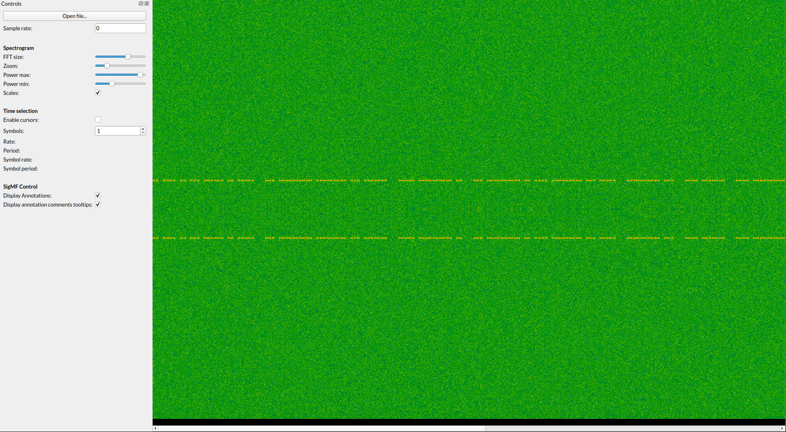
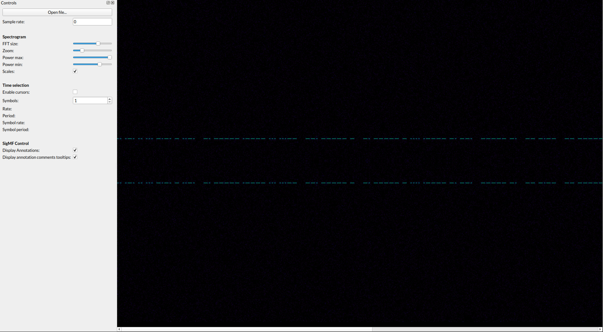

# dotdotdot

Points: 50

> I picked up this transmission, but it's way too noisy to make any sense of it. Can you give it a shot?

`Author: skat`

---

In hindsight, the challenge's name should have been a dead giveaway that this challenge was all about morse. But I realized that only when I got the flag. Wasn't too much of problem though as this challenge didn't give much room to pursue anything wrong anyway.

We are given the audio data as `iq` file. The first thing I needed to figure out was what `iq` files are. Turns out that this is the most widely used data format used in `Software Defined Radios`(or SDRs). But why use `iq` instead of regular audio formats?

First, common audio formats such as `mp3` or `wav` are basically snapshots of an audio source's displacement at a fixed sample rate, and is always measured in the time domain. A more mathematical way of saying the same would be that common audio formats only contains real-valued data. `iq` files on the other hand, work with complex-valued data. Now why you do this is to factor `negative frequencies` in an audio signal. Negative frequency information in an audio file are basically useless for 99.9% of digital audio's usecases, but in SDRs this becomes sort of a necessity. Modern radio systems use complex modulation systems that require amplitude and phase to be handled simulatneously, and `iq` files are a natural fit for this. A lot of other DSP algorithms (especially the Fourier Transform) are also a lot more straightforward to implement for audio data stored in complex formats.

Second, we also have an easier way to measure power of waveform when audio is stored as complex-valued data, but I just realized that I might have covered WAY more stuff than what is actually necessary for this challenge. So I digress. Here's a juicy [article](http://whiteboard.ping.se/SDR/IQ) which goes to a deeper explanation on why `iq` is preferred and what it actually is.

The next logical step was to visualize the data that I had in hand. A quick google search threw up this pretty simplistic audio visualizer called `inspectrum`, thankfully `apt` had it already so I didn't have to build anything myself. I fed the data I had into inspectrum and I got presented with this radioactive-looking spectrum with some lines drawn into it.



Here is a pic without the noise.



which, obviously, is morse code.

So I pulled up a morse code translator online and punched the dots and dashes into it (also keeping the mind the space between words, given by the gaps in transmission between words) and ended up with `irisctf{n01s3_g0t_n0th1ng_0n_my_m0rs}`. Seemed pretty convincing to me, entered it, was wrong. Tried it with `m0rs3` instead, still wrong. In true KISS fashion, just tried `m0rse` instead, to finally end up with the correct flag.

---

```sh
irisctf{n01s3_g0t_n0th1ng_0n_my_m0rse}
```
