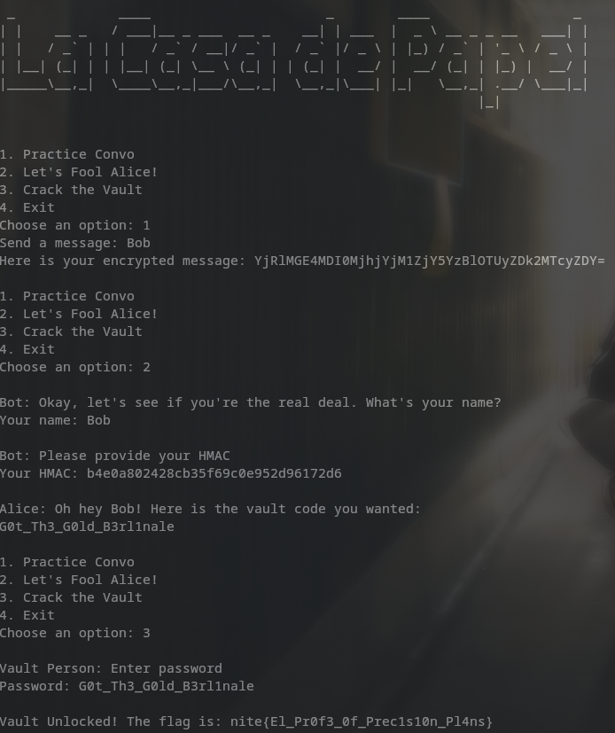

# La Casa de Papel

Points: 50

__crypto__

> Word on the street is Bob's about to make a big withdrawal. Too bad you're the one holding his ID. Can you charm Alice into making the transfer before she catches on?

Author: Wixter_07

```ncat --ssl la-casa-de-papel.chals.nitectf2024.live 1337```

---

honestly pretty trivial, you barely need to understand the challenge



```python
def practice_convo(secret):
    message = input("Send a message: ")
    hash = md5(secret, message.encode('latin-1'))
    print(f"Here is your encrypted message: {hash}")
```

The `practice_convo` menu option simply gives us a base64 encoding of the md5 hash of our input

```python
def fool_alice(secret):
    print("\nBot: Okay, let's see if you're the real deal. What's your name?")
    user_name = input("Your name: ").encode('latin-1')
    user_name = user_name.decode('unicode_escape').encode('latin-1')
    print("\nBot: Please provide your HMAC")
    user_hmac = input("Your HMAC: ").encode('latin-1')

    if b"Bob" in user_name:
        hash = base64.b64decode(md5(secret, user_name))
        if user_hmac == hash:
            print("\nAlice: Oh hey Bob! Here is the vault code you wanted:")
            with open('secret.txt', 'r') as file:
                secret_content = file.read()
                print(secret_content)
        else:
            print("\nAlice: LIARRRRRRR!!")
    else:
        print("\nAlice: IMPOSTERRRR")
```

The `fool_alice` menu option is basically us pretending to be Bob. We put our name as Bob and the base64 decoded input of the output of `practice_convo` and that gives us the password

We input the password to our `crack_vault` option and get the flag


```flag: nite{El_Pr0f3_0f_Prec1s10n_Pl4ns}```

I'm assuming this is a Money Heist reference but idk, never watched it
