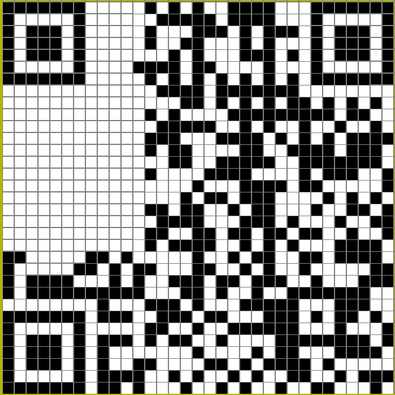

# tet-riffic!

Points: 231

__forensics__

> With no friends to confide in, I seek solace in retro and nostalgic games. I am trying to make something but alas just like the description its not...

Author: YouGuess, xenon

---

very frustrating challenge fr. I would have solved it in like 30 more minutes. We would have been 89th then

We are given the files `tetric.pcap` and `tetris.py`. 

`tetris.py` defines a game. We notice that there are __cheat__ blocks which are 1x1s, and that
blocks have colors. This is interesting.

Then we look at `tetris.pcap`. I notice there are only USB protocols. I didn't know Wireshark let you record USB events too. So I started looking for ways to understand this traffic.

I come across this [fantastic writeup](https://naykisec.github.io/USB-Keyboard-packet-capture-analysis/) of a similar event where they are `.pcap` of a apple keyboard. The way they checked the devices was by searching for `DEVICE` in Wireshark, so I do the same and see 4 different devices. 
- bDeviceClass: Wireless Controller (0xe0) (Bluetooth interface)
- idVendor: Microdia (0x0c45) (most likely the charger)
- idVendor: Shenzhen Goodix Technology Co.,Ltd. (0x27c6) (most likely the display)
- bDeviceClass: Hub (0x09) (main hub)
- **idVendor: Arduino SA (0x2341)** --> this is what we want
    - on `3.0.0`, `3.26.0` and `3.27.0`

Next the writeup looked for `USB_INTERRUPT` requests, so searching for `INTERRUPT` gave me a lot of `URB_INTERRUPTS` going from `3.26.4` and `3.27.4` to the host, and inspecting their `HID (human interactable device)` data would give me the keypresses I want

I initially found [this](https://github.com/j-marz/usb_hid_hex_to_keys/blob/master/usb_hid_keys) that I could use to decipher the keys

eg. the first keypress we find is 
`HID Data: 020000130000000000` ---> \<SHIFT p\> which will eventually spell out "PYTHON"

I then found this [fantastic repo](https://github.com/Nissen96/USB-HID-decoders) to extract the keypresses and decipher them. I used the `extract_hid_data.sh` and `keyboard_decode.py` scripts.

Let's see what `extract_hid_data.sh` does. This will be useful for the future.

From the repo's readme
```sh
tshark -r <pcap-file> -Y "usb.capdata || usbhid.data" -T fields -e usb.src -e usb.capdata -e usbhid.data |  # Extract usb.src, usb.capdata, and usbhid.data from all packets with HID data
sort -s -k1,1 |  # Sort on first field only (usb.src)
awk '{ printf "%s", (NR==1 ? $1 : pre!=$1 ? "\n" $1 : "") " " $2; pre=$1 }' |  # Group data by usb.src
awk '{ for (i=2; i<=NF; i++) print $i > "usbdata-" $1 ".txt" }'  # For each group, store data in usbdata-<usb.src>.txt
```

Basically the `HID` data is stored in `usbhid.data` in wireshark. The `-Y` flag lets us specify a display filter, in this case `usbhid.data`. The `-T` flag lets us choose the fields we want to output by using the `-e` arguments. We then sort that output to group by `usb.src`, and output the keypresses from each source in their own file with `awk` 

Once we have our keypress data, we can use the `keyboard_decode.py` script. It allows us to replay to keypresses with `python-keyboard`. I initially had some trouble using it, virtualenv didn't work and because I was sourcing an env `yay -S python-keyboard` was throwing errors too. That was entirely my bad though.

I also had to go into the script to make changes because it asked you to press \<SPACE\> on the window you wanted to access, which would mess with the game, since that was a command you could use. I initially changed it to \<RETURN\> and eventually to just \<H\>. 

I also had to change the keypresses in the `.txt` files since they were being passed as capitals with \<SHIFT>. Not sure if that really made a difference, but I wanted to be sure.

I also changed the fps in the game to 30 to do stuff faster.

```bash
sudo python keyboard_decode.py -m replay usbdata-3.26.4.txt -d 10 && sudo python keyboard_decode.py -m replay usbdata-3.27.4.txt -d 10
``` 

in one window and 

```sh
python tetris.py
```

in the other

<div style="display:flex;align-items:center;justify-content:center;padding:1rem"></div>

At this point it's like 6.10pm IST and I have been betrayed because I thought this would give me the flag and our team would be much better ranked. However the organisers were feeling cruel. 

First thing I do is open GIMP and add the 2 other finder patterns (the big boxes) in the hopes that it would be enough to let me scan it (fuzzy select ftw). It wasn't and atp the CTF has ended. 

<div style="display:flex;align-items:center;justify-content:center;padding:1rem"></div>

That doesn't work so I reconstruct the qr manually in [Qrazybox](https://merri.cx/qrazybox/), and finally `Tools > Extract Information` gives me the flag. 

Going forward, I need to be able to do this faster. Qrazybox has an import from image option, but it's really finnicky, so I could either have increased contrast in the gimp image and gotten rid of the gridlines somehow, or edited the tetris game to not have grids and have a white background. 

---

<div style="display:flex;align-items:center;justify-content:center;padding:1rem"></div>

Doesn't get scanned though

```
flag: nite{mayb3_th3_r3al_tetr15_wa5_qrc0d3s_we_mAd3_a10ng_th3_way}
```

